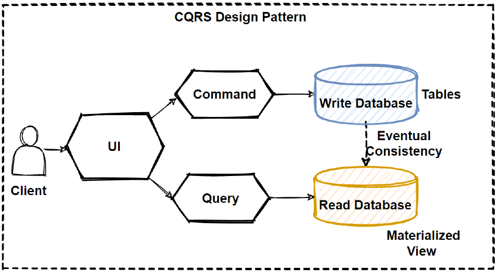
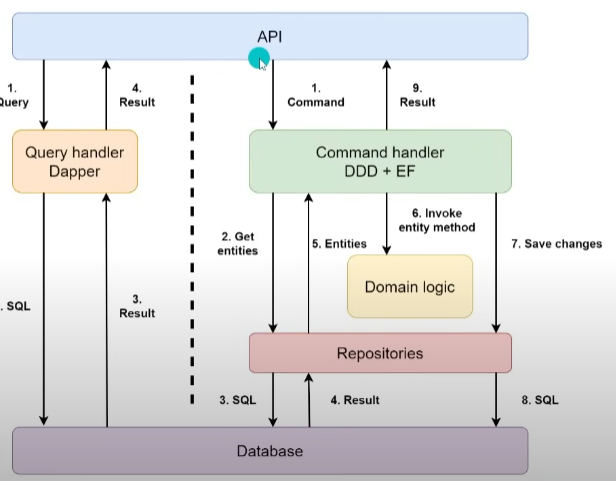

### **Course/Resource**  
[CQRS Pattern in Clean Architecture](https://www.youtube.com/watch?v=85YbMEb1qkQ)

### **Key Concepts**
- Command Query Responsibility Segregation
- Requests are fufilled by handlers, handlers is either a command to augment the data or something to return data.



### **Detailed Notes**
- **What is CQRS**:
  - Commands
    - Commands update data
  - Queries
    - Queries read data
  - CQRS splits the flows for writing data and reading data
  - Before CQRS there was CQS (Command Query Seperation) and focusses on distinguiting methods on an object between commands and queries. 
  - CQRS doesn't have to use different databases for its commands and queries, the seperation/ segregation can be done at a logical level.
  
  - Doing it this way promotes **separtion of concerns**
  - Improves security and scalability.
- **Structure**
- An example folder structure may look something like this:
  ```
      Core
      └── Application
          └── Features
              └── {Feature}
                  ├── Handlers
                  │   ├── Commands
                  │   └── Queries
                  └── Requests
                      ├── Commands
                      └── Queries
  ```

  
### Best Practices
- 